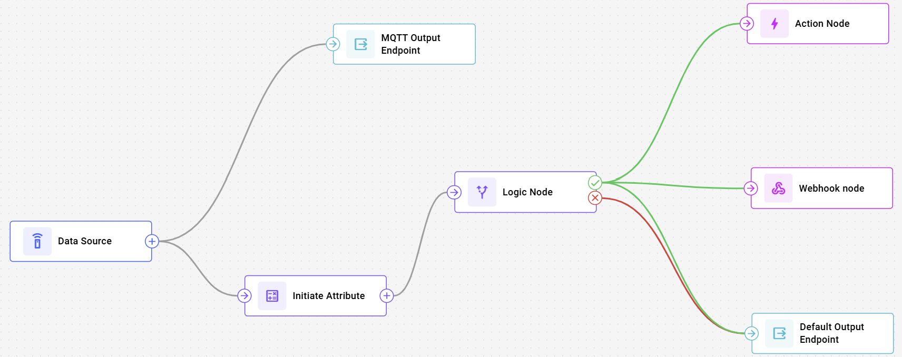

# Navixy IoT Logic API

IoT Logic is the data processing layer of the Navixy platform. It receives messages from connected devices, decodes and transforms them in real time, and delivers the results to Navixy or to an external system. Flows are normally built in a visual editor. The IoT Logic API exposes the same functionality programmatically, so flow configuration can live in your own code and deployment pipeline instead.

Use the API to:

* Create, read, update, and delete flows, the pipelines that define how device data is processed.
* Choose which devices feed each flow, and merge data from an external system into a device's stream.
* Calculate new attributes from raw readings with [Navixy IoT Logic Expression Language](Technologies/navixy-iot-logic-expression-language/).
* Route messages conditionally and send commands back to devices.
* Deliver processed data to the Navixy platform, to an MQTT broker, or to an HTTP endpoint, standardized as [Navixy Generic Protocol](Technologies/navixy-generic-protocol/navixy-generic-protocol.md) messages.

The API is built for developers and system integrators who manage device data at scale, who need transformations that standard platform features don't cover, or who want the same flows reproduced across several accounts.

## How to use this documentation

This space documents the IoT Logic API in full. Choose the path below depending on who, or what, is reading.

### For developers

Start with [Key concepts](#key-concepts) below to see how flows and nodes fit together, then get access: [Authentication](authentication.md) covers obtaining a session hash or an API key.

Once you're authenticated, build something. [Quick start: create your first flow](navixy-iot-guide/quick-start-create-your-first-flow.md) creates a working flow with one request, with every parameter explained. From there, [Guides](navixy-iot-guide/) walks through other common integrations, like sending data to an external MQTT broker or adding calculated attributes to the Navixy UI.

While you build, look things up in [Technical reference](technical-details/) (rate limits, error codes, validation rules), [Flow object structure](flow-schema-structure/) (the JSON shape of a flow), or the interactive [API reference](resources/api-reference/) with its "Try it out" tool. Once a flow is running, [WebSocket access to Data Stream Analyzer](Websocket-access-for-DSA.md) lets you watch the data it actually produces in real time.

### For AI agents and LLMs

* **[OpenAPI specification](https://raw.githubusercontent.com/Navixy/navixy-public-docs/refs/heads/main/api-docs/iot-logic-api/resources/api-reference/IoT_Logic.json)**: the raw JSON specification for every endpoint, parameter, and schema. Treat this as the technical source of truth.
* **[Navixy docs via MCP](https://navixy.com/docs/navixy-mcp/using-navixy-documentation-with-ai)**: connect to query this documentation interactively instead of parsing static pages.
* **[AI flow generation guide](navixy-iot-guide/ai-flow-generation-guide.md)**: authoritative rules and canonical examples for generating IoT Logic flow JSON.

### Underlying technologies

Both paths eventually touch the protocols IoT Logic is built on: [Navixy Generic Protocol](Technologies/navixy-generic-protocol/navixy-generic-protocol.md), the message format flows use, and [Navixy IoT Logic Expression Language](Technologies/navixy-iot-logic-expression-language/), the syntax for calculated attributes and conditions.

## Key concepts

Navixy IoT Logic operates based on two fundamental components that work together to process device data:

### Flows

A **Flow** is the foundation for all data logic in the product. It defines how data moves through stages of reception, enrichment, and transmission. Each flow consists of connected nodes that determine what happens to the data at each processing stage.

Key characteristics of flows:

* Flows can be enabled or disabled to control data processing
* Every flow requires at least one data source and one output endpoint
* A device can belong to multiple flows at the same time. Flows that include the same device all process its data simultaneously, results merge rather than one flow excluding another. See [Connector configuration](technical-details/nodes.md#connector-configuration) for a case where this matters: two flows pushing the same attribute name to a shared device can silently overwrite each other
* Flows process data in real-time as it arrives from devices

### Nodes

**Nodes** are the functional elements of a **flow**, with each node handling a specific stage of the data lifecycle. Common node types include:

* [Data Source node](technical-details/nodes.md#data-source-node-data_source): selects which devices send data into the flow, and can merge data from an external system into an existing device's stream through its connector fields
* [Initiate Attribute node](technical-details/nodes.md#initiate-attribute-node-initiate_attributes): transforms and enriches data using [Navixy IoT Logic Expression Language](Technologies/navixy-iot-logic-expression-language/)
* [Logic node](technical-details/nodes.md#logic-node-logic): routes data based on conditions
* [Webhook node](technical-details/nodes.md#webhook-node-webhook): sends HTTP POST requests to your external endpoint
* [Device action node](technical-details/nodes.md#device-action-node-action): sends commands to devices
* [Output Endpoint node](technical-details/nodes.md#output-endpoint-node-output_endpoint): transmits data using the [Navixy Generic Protocol](Technologies/navixy-generic-protocol/navixy-generic-protocol.md). This node can be configured to use different endpoint types:
  * **Default endpoint**: Pre-configured destination for sending data to the Navixy platform
  * **MQTT endpoint**: Configurable connection for sending data to third-party systems and services

Nodes are connected through transitions (`edges`) that define the path data follows through the flow.

### How data moves through a flow

A single flow can stream data continuously to one destination while also branching conditionally to trigger side effects elsewhere. The diagram below shows both patterns together: a Data Source feeding an MQTT Output Endpoint directly, and the same source, through an Initiate Attribute node, feeding a Logic node that evaluates each message.

<figure><figcaption>A Logic node's true and false branches can each fan out to multiple destinations at once, so one condition can trigger a device command, notify an external system through a webhook, and keep streaming to Navixy, all from a single evaluation.</figcaption></figure>

Because the Logic node evaluates every message independently, each branch can run several destinations in parallel instead of following one fixed path. Terminal nodes like Action and Webhook always run alongside an Output Endpoint, so triggering a side effect never costs you visibility into the underlying data in [Data Stream Analyzer](Websocket-access-for-DSA.md).

See [Nodes](technical-details/nodes.md) for the full schema and options for every node type.

## Next steps

* To build a working flow in one request, see [Quick start: create your first flow](navixy-iot-guide/quick-start-create-your-first-flow.md).
* To send processed data to your own MQTT broker, see [Sending device data to an external system](navixy-iot-guide/scenario1.md).
* To look up the fields of a specific node type, see [Nodes](technical-details/nodes.md).
* To understand a formula error, see [Formula error reference](Technologies/navixy-iot-logic-expression-language/formula-errors.md).

For questions and support, contact [support@navixy.com](mailto:support@navixy.com).
