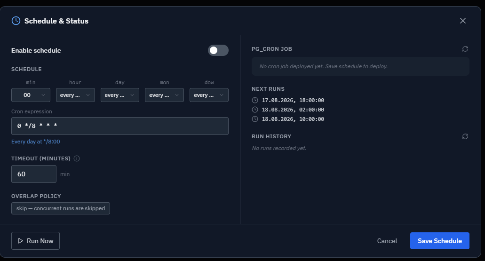
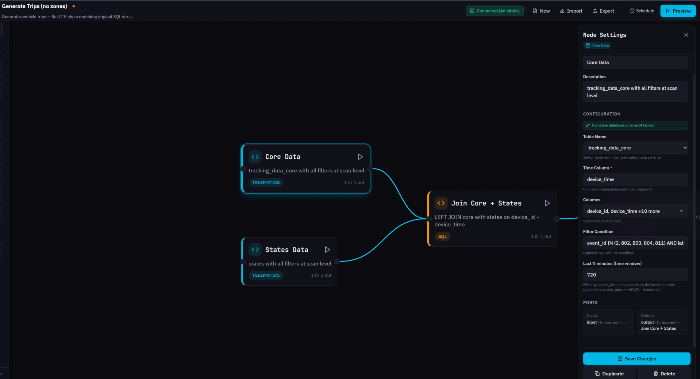

# Customizing trip detection in telematics software

This article shows how system integrators adjust the built-in trip-detection logic to match a specific fleet operation: courier delivery, heavy equipment, or dispatch that needs near-live data. That logic is a graph of processing nodes, sources feeding transformations feeding one output, compiled into a single SQL query. The graph can be edited visually in [Transformation Builder](https://app.gitbook.com/s/oFNFEIINiGFbhi3Px3dE/iot-query/schema-overview/transformation-layer/transformation-builder), or directly as the YAML file it compiles from: the same form an AI assistant, or an autonomous AI agent acting on a natural-language request, can read and write.

## Why doesn't one trip definition fit every fleet operation?

A trip is not something a GPS device reports directly. It's a derived entity, assembled from a stream of raw points: coordinates, speed, time, and satellite count. Navixy's built-in `processed_common_data.trips` transformation turns that stream into trip records by evaluating, point by point, whether the vehicle is moving, whether a stop is long enough to end a trip, and whether the resulting segment is substantial enough to count as one.

The default thresholds behind those decisions, a 5-minute parking duration and a 20-minute data gap timeout, reflect general-purpose vehicle movement. They don't hold for every operation. A courier's 6-minute stop at a building entrance is not a meaningful break in the route, but the default logic can still close the trip there. Heavy equipment on a job site may move only 50 meters between tasks, a distance the standard filter treats as noise rather than a trip. A dispatcher tracking near-live movement needs the underlying data refreshed faster than the default 8-hour cycle allows.

This article shows these thresholds inside Transformation Builder's canvas, because the visual graph makes the underlying logic easy to follow. The same values are just as editable directly in the YAML file the canvas compiles from. That's the more natural route when an AI agent, rather than a person, is making the change. Loading the template and adjusting a handful of Custom SQL nodes, on the canvas or in YAML, produces a custom transformation, written to `processed_custom_data`, that reflects what a trip actually means for a given fleet, while the unmodified built-in transformation keeps running in parallel. See [How can trip logic be versioned and edited as YAML?](customizing-trip-detection-for-your-business.md#how-can-trip-logic-be-versioned-and-edited-as-yaml) below for the YAML side of this.

## How do Navixy partners customize trip detection for their fleets?

The flows below show how partners adjusted trip-detection parameters for different industries. Each one starts from the same Trips template and changes only the values that operation needed: a threshold, a filter, a lookup, or a schedule.

### How courier delivery patterns change the parking and gap thresholds

Watch how the parking threshold and gap timeout change in the Trip Flags and Parking Markers nodes for a courier delivery route:

{% embed url="https://files.gitbook.com/v0/b/gitbook-x-prod.appspot.com/o/spaces%2F1ccm6ICo1ki8M9T4JUl7%2Fuploads%2Fgit-blob-52a913aab7ec53934e0472ba336d874ea9f82b2c%2Ftrip-detection-use-case-1.mp4?alt=media" %}

A courier route with 20 stops rarely involves a single continuous drive. Each stop lasts 3 to 4 minutes, under the default 5-minute parking threshold, but a stop that runs slightly long, or a longer indoor delivery that triggers the 20-minute gap timeout, still closes the trip and starts a new one. The report then shows a fragmented route instead of one delivery run.

Raising the minimum parking duration from `300` to `600` seconds and the data gap timeout from `1200` to `1800` seconds keeps stops of this length inside the same trip. Both values are hardcoded integer constants in the **Trip Flags** and **Parking Markers** Custom SQL nodes. See [Adjusting stop and gap thresholds](https://app.gitbook.com/s/oFNFEIINiGFbhi3Px3dE/iot-query/schema-overview/transformation-layer/common-transformations/trips#customizing-the-transformation) on the Trips page for the exact node names and condition text. The trade-off runs the other way too: a 10-minute threshold also means a genuine break, a lunch stop or an end-of-shift parking, takes longer to register as the end of a trip. Preview the result against a sample of real delivery logs before scheduling the workflow, to confirm the new boundaries match how the route actually operates.

### How heavy equipment changes the valid-trip filter

Watch how the `HAVING` conditions in the final aggregation node, and the movement classification feeding it, change so short equipment moves count as valid trips:

{% embed url="https://files.gitbook.com/v0/b/gitbook-x-prod.appspot.com/o/spaces%2F1ccm6ICo1ki8M9T4JUl7%2Fuploads%2FxEeWVEUYWj7ParP3I0u2%2F%D1%81%D1%86%D0%B5%D0%BD%D0%B0%D1%80%D0%B8%D0%B9%202%20cut.mp4?alt=media&token=75e3524d-3e7d-412b-a55e-26e1ec0a4eb9" %}

The default quality filter discards any segment under 100 meters or 3 km/h, on the assumption that shorter movement is GPS drift rather than a real trip. That assumption holds for road vehicles and breaks down for heavy equipment, which can move 50 to 80 meters between job areas at low speed and never produce a segment large enough to pass the filter. The result is equipment that clearly relocated during a shift, with no trip record to show for it.

Two nodes need to change together here, not just one. The **Moving Status** node decides whether a point counts as movement before a trip boundary is even considered, and its default speed threshold rejects the equipment's own movement before the final filter ever sees it:

```sql
-- Moving Status, was:
WHEN speed >= 3 AND (distance_meters > 50 OR is_moving = 1) THEN 'moving'
-- becomes:
WHEN speed >= 1 AND (distance_meters > 10 OR is_moving = 1) THEN 'moving'
```

Only once these slower points are classified as movement does lowering the thresholds in the final aggregation node's `HAVING` clause have anything to admit:

```sql
HAVING COUNT(*) >= 2
   AND MAX(w.speed) >= 1           -- was 3 km/h
   AND ROUND(ST_Length(...)) >= 30 -- was 100 meters
```

The same assumption the default filter relies on still applies here, just at a smaller scale: the lower the thresholds, the more GPS drift during parking looks like a real trip. Lowering the **Moving Status** threshold compounds that risk on its own, since equipment idling with the engine running but not relocating can now also read as "moving." Validate the change against a sample of known equipment movements, not just the preview row count, before scheduling the modified workflow.

### How to add zone names to a workflow built without them

The **Generate Trips (no zones)** workflow used as the example throughout this article resolves a trip's start and end to coordinates only, `55.7558, 37.6173`, which tells a dispatcher nothing without a map open. This is a property of that specific starter workflow, not of trip detection in general: the production `processed_common_data.trips` transformation already resolves these coordinates against `processed_common_data.zones_geom` as part of its standard aggregation step (see [Trips](https://app.gitbook.com/s/oFNFEIINiGFbhi3Px3dE/iot-query/schema-overview/transformation-layer/common-transformations/trips)). A workflow built from the zoneless template doesn't get that resolution until it's added.

Adding it means restructuring the workflow's final stage: the single node that used to aggregate trip metrics and number the trips together splits into four:

* **Aggregated Trips** (Custom SQL). Takes over the aggregation step from the old final node, producing the same metrics, distance, speed, duration, from **Trip Coordinates** and **Trip Geometries**, but without the row numbering: an intermediate result ahead of the zone join.
* **Final Trips** (Custom SQL). Adds back the `ROW_NUMBER() OVER (PARTITION BY device_id ORDER BY trip_start_time)` column, `trip_number`, on top of **Aggregated Trips**, restoring the continuous trip numbering the old node produced in one step.
* **Zones Match** (Custom SQL). Runs in parallel with **Aggregated Trips**, off **Trip Coordinates** alone. Takes each trip's start and end coordinates and matches them against `processed_common_data.zones_geom` using `ST_DWithin()`, returning the zone name the point falls into, if any.
* **Final Output** (Custom SQL). Joins **Final Trips** with the **Zones Match** results using a `LEFT JOIN`, adding two fields to the output:

| Field        | Description                                                     |
| ------------ | --------------------------------------------------------------- |
| `start_zone` | Name of the geofence containing the trip's start point, or null |
| `end_zone`   | Name of the geofence containing the trip's end point, or null   |

Connect **Trip Coordinates** to both **Aggregated Trips** and the new **Zones Match** node, connect **Trip Geometries** into **Aggregated Trips** as well, chain **Aggregated Trips** into **Final Trips**, then join **Final Trips** and **Zones Match** into the new **Final Output** node and repoint the workflow's output to it. Run **Execute**: a trip that was "point A to point B" becomes "Warehouse to Customer." Skip this if the workflow is already built from the standard Trips template rather than the zoneless variant. It performs this match already.

### How dispatch urgency changes the schedule and time window

The built-in Trips transformation runs every 8 hours (`10 */8 * * *`) and reads a 12-hour window of data (`time_window_minutes: 720` on the **Core Data** and **States Data** source nodes), a balance between database load and data freshness that suits reporting but not dispatch. A dispatcher who needs near-live trip data is changing the same trade-off in the opposite direction, and that means moving two settings together, not one.

Shortening the schedule without narrowing the **Last N minutes** window on those source nodes just means every run reprocesses the same 12-hour range more often, at a database cost with no freshness benefit. Narrowing the window without shortening the schedule has the opposite failure mode: the workflow can miss trips that fall near the boundary between runs. As a rule of thumb, the window needs enough overlap past the run interval to catch a trip that started just before the previous run fired; confirm the specific margin against real data with **Execute** rather than assuming a fixed ratio.

<figure><figcaption><p>The Schedule &#x26; Status dialog controls the cron expression, timeout, and overlap policy for a workflow.</p></figcaption></figure>

<figure><figcaption><p>Changing the <strong>Last N minutes</strong> value on a source node adjusts its time window independently of the cron schedule.</p></figcaption></figure>

Two more settings in the **Schedule & Status** dialog affect reliability rather than timing. **Timeout** caps how long a single run is allowed to execute, 60 minutes by default. A run that regularly approaches this limit is a sign the query or the schedule needs attention, not something to raise indefinitely. **Overlap policy** decides what happens when a new run starts before the previous one has finished. The default, `skip`, drops the new run rather than letting two instances write to the same output table at once. Saving the schedule registers a `pg_cron` job that triggers the workflow automatically. Its status, next runs, and run history are all visible in the same dialog.

## How can trip logic be versioned and edited as YAML?

Every workflow also exists as a YAML file that can be exported, edited outside the UI, and re-imported. The format is version 2: a flat, topologically ordered array of nodes (`cte_nodes`, sources before transformations before the output), a separate `edges` array recording the connections between them, and an optional `schedule` block.

```yaml
version: 2
name: Generate Trips (no zones)
description: "Generates vehicle trips"

cte_nodes:
  - id: telematics_1            # unique node identifier
    type: telematics             # type: telematics, business, sql, arithmetic,
                                  #       custom, filter, resample, output
    label: Core Data             # name shown on the canvas
    sources: []                  # upstream nodes (empty for source nodes)
    params:                      # node parameters
      table_name: tracking_data_core
      time_window_minutes: 720
      columns: [device_id, device_time, speed, ...]
      filter_condition: "..."

  - id: custom_5
    type: custom
    label: Moving Status
    sources: [filter_1]          # this node receives data from filter_1
    params:
      custom_sql: |-
        SELECT *,
            CASE
                WHEN speed >= 3 AND distance_meters > 50 THEN 'moving'
                ELSE 'stopped'
            END AS moving_status
        FROM filter_1

edges:                           # connections between nodes
  - { source: telematics_1, target: sql_1 }
  - { source: sql_1, target: arithmetic_1 }

schedule:                        # present only when scheduling is enabled
  cron: "0 */8 * * *"
  timezone: UTC
```

This excerpt shows 2 of the workflow's 16 nodes, enough to illustrate the shape of the format. The `custom_sql` for every node lives in the actual exported file, not in this article: get it from the [Trips template](https://app.gitbook.com/s/oFNFEIINiGFbhi3Px3dE/iot-query/schema-overview/transformation-layer/transformation-builder/templates#trips) or by exporting an existing workflow. An AI assistant, generator, or agent building or editing this workflow needs that file as input, the same way a person does. Treat every snippet in this article as a citation of one specific node, not a substitute for the file itself.

The `sources` field is what actually drives execution order: it's the YAML equivalent of the arrows on the canvas. The `edges` array carries the same connections in "source to target" form, kept so the Builder can redraw the graph on import. `params` holds whatever is specific to a node's type:

* Table, columns, and filter condition for a source node.
* The query text for a Custom SQL node.
* The list of expressions for an Arithmetic node.

This matters beyond convenience. A YAML file can be stored in git and diffed like any other configuration, which turns a threshold change into a reviewable commit instead of a UI action nobody can audit later. The same file imports unchanged into a different Navixy account, which is how one trip definition gets deployed identically across multiple clients. And because a node's logic is plain text, changing a hardcoded threshold across several Custom SQL nodes becomes a find-and-replace operation instead of opening each node in turn.

For the complete field reference, including every node type's `params` shape, see the [Workflow YAML reference](https://app.gitbook.com/s/oFNFEIINiGFbhi3Px3dE/iot-query/schema-overview/transformation-layer/transformation-builder/workflow-yaml-reference). The rest of this section covers what's specific to editing threshold logic like the Trips workflow's: how a Custom SQL node sees its inputs, and how to tell a safe edit from a risky one. The same two questions apply to any workflow, not just this one.

### How a Custom SQL node exposes upstream data

Every threshold changed in this article (parking duration, gap timeout, moving-status speed, the `HAVING` filter) lives inside a **Custom SQL** node: the node type used for any logic beyond what a Filter or Arithmetic node can express. A few rules govern how it sees the rest of the graph, and hold regardless of what the workflow actually computes:

* **Upstream nodes are plain CTE names, not aliases.** If a node is connected from `custom_8`, its `custom_sql` refers to that input simply as `custom_8`, no prefix. Two connected sources means two CTE names available in the same query. The **Final Output** node from the zone-matching example above joins its two inputs with `FROM custom_15 f LEFT JOIN custom_13 zm ON zm.device_id = f.device_id AND zm.temp_trip_id = f.temp_trip_id`, referencing **Final Trips** and **Zones Match** directly by their node ids.
* **`custom_sql` is one CTE body, not a full statement.** The compiler wraps it as `<node_id> AS (<custom_sql>)`. A nested `WITH ... AS (...)` inside it will not compile; use a subquery instead if the logic needs an intermediate step.
* **A value can be parameterized instead of hardcoded.** A node's `params` can hold arbitrary extra keys, and any `{{key_name}}` placeholder inside `custom_sql` is substituted with that key's value, as a plain string, before compilation. This is how the parking threshold could be defined once, `p_parking_seconds: 600` in **Trip Flags**' (`custom_9`) `params`, and referenced as `{{p_parking_seconds}}` in the SQL, instead of typed as a literal `600` in both **Trip Flags** and **Parking Markers** (`custom_6`), the two nodes that, as the courier example above showed, need to change together.

### What's safe to change in a node's SQL, and what isn't

A number in a `WHERE` clause and a `JOIN` condition are both just SQL, but changing one is a threshold adjustment and the other can break every node downstream. The table below applies to any workflow built this way, not only Trips:

| Change type | Risk | Why |
| --- | --- | --- |
| A literal number inside a `WHERE`, `HAVING`, or `CASE WHEN` condition | Safe | It only moves a boundary; the columns and logic around it stay the same. |
| A join condition, or the `PARTITION BY` / `ORDER BY` clause behind a window function | Caution | Every downstream `LAG`, `LEAD`, or running total depends on this exact ordering; changing it changes what every later node receives, not just this one. |
| A unit-conversion divisor (`/ 1e7`, `/ 1e2`) | Caution | Raw values are stored scaled; changing or removing the divisor produces silently wrong numbers rather than an error. |
| A window frame bound (`ROWS BETWEEN UNBOUNDED PRECEDING ...`) | Caution | These are usually deliberate, carrying a value forward or aggregating an entire trip, and rarely accidental default settings. |
| Renaming a node's `id` | Caution | The id is the CTE name every downstream node refers to; renaming it means updating every reference, not just the node itself. |
| Deleting a node whose output columns feed more than one downstream node | Requires a refactor | Removing it breaks every node that reads a column only it produces, not just the one directly connected to it. |

In the Trips workflow, this maps onto real nodes: the parking and gap thresholds in **Trip Flags** and **Parking Markers** are safe, literal-number edits (see [How courier delivery patterns change the parking and gap thresholds](customizing-trip-detection-for-your-business.md#how-courier-delivery-patterns-change-the-parking-and-gap-thresholds) above); the `device_id` + `device_time` join earlier in the graph is an identity join that every LBS flag downstream depends on; and deleting **With Distance** would break **Moving Status**, **Final Output**, and **Trip Geometries** at once, since all three read a column only it produces.

### Three ways to bring AI into the edit loop

"AI assistant" and "AI agent" get used loosely to mean very different levels of involvement, and it's worth telling them apart before handing a workflow to either. Because a workflow's logic is plain text with self-describing node labels, all three levels below can read an exported YAML file and act on it without a person opening each node in Transformation Builder in turn. The difference is how much of the edit-import-run loop each one closes itself.

| Mode | Loop | Who verifies |
| --- | --- | --- |
| **AI assistant** | You hand it the YAML. It tells you which nodes and values to change. You make the edit yourself. | You, before and after: you write the change and read the diff. |
| **AI workflow generator** | You hand it the YAML plus a requirement. It returns a complete, new YAML. You import it and click **Execute**. | You, after: the generator produced the file, but you decide whether to import and run it. |
| **Autonomous agent** | It receives the requirement, reads the current workflow, edits the file itself, imports it, runs it, and compares the result against a target. | The agent, continuously: a person is only in the loop if something is surfaced to them. |

In practice:

* **AI assistant**: *"Here's my workflow (YAML). I need to change the parking threshold from 5 minutes to 15. Which nodes do I need to change, and which values do I need to replace?"* You get back node names and values; you make the edit and read the diff yourself.
* **AI workflow generator**: hand over the YAML and a requirement, for example "add a 4-hour schedule to this workflow," and get back a complete file with the change applied, including an updated `schedule` block:

```yaml
schedule:
  cron: "0 */4 * * *"   # every 4 hours
  timezone: "UTC"
```

  You still import it, click **Execute**, and check the compiled SQL and a sample of real rows before saving.
* **Autonomous agent**: closes the loop itself. It also imports the file, runs **Execute**, and compares the output against a target, a set of known trips, a row count, a stop that should now merge into one trip, before deciding the change is good. A person is only pulled in if that comparison fails or looks uncertain.

Whichever mode is in play, nothing in the compiled SQL knows it was written by an assistant, a generator, or an agent. Validation works the same way for all three: **Execute**, then a sample of real rows, before anything runs on a schedule. What changes between the three modes is how much of that validation a person still does by hand. That's exactly why the next section matters more as an agent takes on more of the loop.

### Give an agent the operational definition of a trip first

A YAML file can import cleanly, compile without error, and still get the business logic wrong: a threshold changed exactly as asked, applied to a definition of "trip" that doesn't match how this fleet actually operates. Nothing in a node's SQL carries the operational context a person brings to the edit implicitly, so an agent that doesn't have it produces a syntactically correct file with a distorted trip definition, and there's nothing in the compiled SQL to reveal the gap.

Before an agent touches the workflow, get it to state, or have it elicit from you, the operational facts:

* What the client considers one trip.
* What a normal stop duration looks like for this operation.
* What kind of stop counts as the real end of a trip, not a pause within one.
* What speeds are normal for this fleet.
* What minimum movement should still count as a trip.
* How dirty the GPS is expected to be: coordinate jumps, LBS noise, signal drift.
* What data gaps look like in practice: how long, how often, under what conditions.
* What latency the result needs: the default 8-hour cycle, or a near-live refresh.
* What asset types are involved: road vehicles, heavy equipment, foot couriers, since each classifies movement differently.
* Whether zones matter for this workflow, or coordinates are enough.
* What set of known, already-understood trips the result will be checked against.

This list maps directly onto the thresholds this article changes: parking duration and gap timeout answer the first three questions, moving-status speed and distance answer the next three, the schedule and time window answer latency, and the `HAVING` filter and zone-matching nodes answer the last three. An agent that has these answers can point at the right node and the right value with the same reasoning shown throughout this article. An agent that doesn't will still produce a workflow that imports and runs; it just won't produce the trip definition the client actually needs.

## What are common trip-detection problems, and how are they fixed?

* **A delivery route splits into several short trips.** The minimum parking duration is shorter than the operation's typical stop. Raise it and re-check against real routes.
* **Short equipment moves never appear in the output.** The default distance or speed filter is rejecting them outright. Lower the `HAVING` thresholds in the final aggregation node, and confirm the change doesn't also admit GPS drift.
* **Trip data is too old for dispatch decisions.** The schedule and the time window are still at their default values. Both need to change together, not just the schedule.
* **A modified workflow produces more trips than expected after lowering a threshold.** This usually means GPS drift or stationary noise is now passing the filter along with the intended shorter moves. Tighten the threshold slightly and compare against a known set of real movements.
* **A threshold was changed in one node, but the workflow still behaves like before.** The same literal value is often duplicated across two nodes, the parking duration in both **Trip Flags** and **Parking Markers**, for example. Check every node that uses the value, or replace the duplicated literal with a single `{{parameter}}` placeholder so it can't drift out of sync again.
* **An AI-generated YAML edit doesn't behave as described.** A generator or agent working from the exported file alone has no access to the underlying data, so its proposed or applied change is a hypothesis, not a verified fix. Run **Execute** yourself and check the compiled SQL and a sample of real rows before trusting it.
* **A workflow an agent produced runs fine but gets the wrong trips.** The file is syntactically correct and still encodes the wrong definition of a trip, usually because the agent never received the operational facts behind the request. See [Give an agent the operational definition of a trip first](customizing-trip-detection-for-your-business.md#give-an-agent-the-operational-definition-of-a-trip-first).

## What should be checked before changing this workflow?

* **Start from the template or an export, not from this article's excerpts.** Load the Trips template from the [Templates](https://app.gitbook.com/s/oFNFEIINiGFbhi3Px3dE/iot-query/schema-overview/transformation-layer/transformation-builder/templates) library, or export an existing workflow. It already reproduces the source nodes, movement classification, and thresholds documented on the [Trips](https://app.gitbook.com/s/oFNFEIINiGFbhi3Px3dE/iot-query/schema-overview/transformation-layer/common-transformations/trips) page; the SQL snippets in this article illustrate specific nodes, not the complete file, and reconstructing the rest from them, by hand or with an AI, risks inventing logic Navixy never shipped.
* **Change thresholds, not structure.** Nearly every business requirement in this article is a numeric change inside an existing Custom SQL node, not a new graph.
* **Preview against real data before scheduling.** Click **Execute** after every change. A threshold that looks correct in isolation can still misclassify trips once it runs against a full day of actual movement.
* **Keep the schedule and the time window in sync.** Treat them as one setting with two parts. Changing only one produces either wasted processing or missed trips.
* **Version threshold changes as YAML, not just in the UI.** A change made only on the canvas leaves no record of what the previous value was or why it changed. See [How can trip logic be versioned and edited as YAML?](customizing-trip-detection-for-your-business.md#how-can-trip-logic-be-versioned-and-edited-as-yaml).
* **Prefer a `{{parameter}}` placeholder over a literal duplicated across nodes.** A threshold typed as a raw number in two or more Custom SQL nodes is two or more places it can fall out of sync; a parameter interpolated with `{{key_name}}` is one.
* **Give it the exported YAML, not a description of the canvas.** Node labels and structure are self-describing enough for an AI assistant, generator, or agent to propose or apply an edit directly from the file. Validate the result with **Execute**, the same as any change made by hand.
* **Give an agent the operational definition before the requirement.** A workflow that imports and runs can still encode the wrong trip definition. See [Give an agent the operational definition of a trip first](customizing-trip-detection-for-your-business.md#give-an-agent-the-operational-definition-of-a-trip-first) above.

## How is custom trip logic defined in telematics software?

A trip is not a fixed concept in telematics software. It's whatever a graph of nodes computes it to be (raw points in, a validated segment out) according to whatever thresholds and logic that graph encodes. Transformation Builder's canvas is one way to assemble that graph. The YAML file underneath it, described in [How can trip logic be versioned and edited as YAML?](customizing-trip-detection-for-your-business.md#how-can-trip-logic-be-versioned-and-edited-as-yaml) above, is the same graph in a form a script, a git diff, or any of the AI modes described in [Three ways to bring AI into the edit loop](customizing-trip-detection-for-your-business.md#three-ways-to-bring-ai-into-the-edit-loop) can act on directly. Every route produces the identical object: nodes connected by edges, compiled into one SQL query with a CTE per node.

Whichever route produced it, a person editing nodes on a canvas, a person walking a change through with an assistant, or an agent that wrote and ran the YAML on its own, the result is only as accurate as the thresholds and logic inside it. A 10-minute courier stop, a 30-meter equipment move, a route that resolves its start and end points to zone names: none of these is a platform default. Each is one fleet's operation, encoded as a graph and validated against that fleet's real movement data. Trust the validation (an **Execute** preview, a sample of known movements), not the fact that a change matches a pattern described in this article, or that it was produced by an AI that never saw the underlying data or the operational facts behind the request.

## See also

* [Trips](https://app.gitbook.com/s/oFNFEIINiGFbhi3Px3dE/iot-query/schema-overview/transformation-layer/common-transformations/trips): Full output schema, the 5-stage algorithm, and the built-in customization examples referenced above.
* [Transformation Builder](https://app.gitbook.com/s/oFNFEIINiGFbhi3Px3dE/iot-query/schema-overview/transformation-layer/transformation-builder): Node types, workflow building steps, and scheduling.
* [Templates](https://app.gitbook.com/s/oFNFEIINiGFbhi3Px3dE/iot-query/schema-overview/transformation-layer/transformation-builder/templates): Download and import the Trips workflow template.
* [Workflow YAML reference](https://app.gitbook.com/s/oFNFEIINiGFbhi3Px3dE/iot-query/schema-overview/transformation-layer/transformation-builder/workflow-yaml-reference): Full YAML export and import format.
