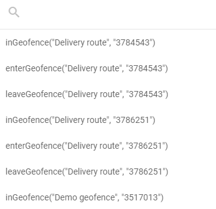

# Geofence functions

Geofence functions let a flow react to where a device is, using the geofences you already have in Navixy. You reference a geofence instead of describing an area with coordinates, so the boundaries stay the same ones you already use for alerts and reports.

## Which function you need

| If you want to                                                                      | Use                                                                                                         |
| ----------------------------------------------------------------------------------- | ----------------------------------------------------------------------------------------------------------- |
| Act on one particular geofence, when a device is inside it, enters it, or leaves it | `inGeofence()`, `enterGeofence()`, `leaveGeofence()`. See [Reacting to one geofence](geofence-functions.md#reacting-to-one-geofence) |
| Find out which geofence a device is in, without naming one in advance               | `geofenceName()`. See [Recording the current geofence](geofence-functions.md#recording-the-current-geofence) |


You must create geofences in Navixy before you can reference them in IoT Logic expressions. To create or manage geofences, see [Geofences](../../../tracking/map-tools/geofences.md).



**`geofenceName()` is a paid option, sold separately.** It is switched off for every account by default, and your service provider enables it per account on request. The other three functions are unaffected and need no extra option.

Contact your service provider to have it switched on. See [Before you start](geofence-functions.md#before-you-start).


## Reacting to one geofence

Use these three functions when you already know which geofence matters. Each one answers yes or no for every data packet the device sends, so a flow can send that data down one branch or another.

| Function            | Answers yes when                                     |
| ------------------- | ---------------------------------------------------- |
| `inGeofence(id)`    | The device is inside the geofence right now          |
| `enterGeofence(id)` | The device has just crossed into the geofence        |
| `leaveGeofence(id)` | The device has just crossed out of the geofence      |

You add them to the condition of an **IF/THEN Logic** node. The `id` is the numeric ID of the geofence in your Navixy account, and a picker fills it in for you, so you rarely type it by hand. See [How to add a geofence condition](geofence-functions.md#how-to-add-a-geofence-condition).

### Syntax



This is the format the geofence picker inserts automatically. The geofence name appears as a comment for readability but has no effect on evaluation.

```jexl
inGeofence(35229 /* Delivery zone #4 */)
enterGeofence(51577 /* Austin Warehouse */)
leaveGeofence(85269 /* Construction site 1 */)
```



Each of the three functions accepts two more parameters, so it can test an earlier position instead of the current one:

```jexl
inGeofence(35229 /* Delivery zone #4 */, 1)
inGeofence(35229 /* Delivery zone #4 */, 1, 'valid')
inGeofence(35229 /* Delivery zone #4 */, 'valid')
```

The second parameter says which data packet to take the position from, counting back from the current one. The third says whether to count packets that carry no position. Both are optional, and they follow the same convention as the `value()` function.

Don't wrap a geofence function inside `value()`. The first parameter of `value()` is an attribute name, not an expression, so a call such as `value("inGeofence(35229)", 1, 'valid')` looks for an attribute with that literal name and always returns an empty value.

For `value()` function details, see [IF/THEN Logic expressions and syntax](logic-node/logic-node-expressions-and-syntax.md).



### How to add a geofence condition

The expression field in the **IF/THEN Logic** node configuration panel includes a dedicated geofence selector , separate from the standard [attribute autocomplete](initiate-attribute-node/managing-attributes.md#autofill-attribute-names). It lists all geofences defined in your Navixy account, grouped by name and ID.

To add a geofence function to your expression:



#### Open the node configuration

Open the **IF/THEN Logic** node by clicking it on the canvas.



#### Open the geofence picker

In the **Condition expression (JEXL)** field, click the geofence picker icon to open the geofence list.

<figure><figcaption></figcaption></figure>



#### Find and select a geofence

Type part of the geofence name to filter the list. Each geofence appears three times, once for each available function. Select the entry that combines the geofence you need with the function that matches your condition:

* `inGeofence` - use when you need to check whether a device is currently located inside the selected zone.
* `enterGeofence` - use when you need to detect that a device moved from outside the selected zone into it.
* `leaveGeofence` - use when you need to detect that a device moved from inside the selected zone to outside it.

The picker inserts the complete function call at the cursor position in the expression field.



#### Combine with other conditions if needed

Use logical operators to combine the geofence function with other conditions. See [Condition examples](geofence-functions.md#condition-examples).



#### Save the configuration

Click **Apply changes** to confirm the node configuration.




The geofence picker only lists geofences that exist in your Navixy account at the time you open the node. If you add a new geofence after opening the node, close and reopen it to refresh the list.


The picker inserts only the three ID-based functions. To use `geofenceName()`, type it into the field yourself.

### Condition examples

<details>

<summary>Single geofence condition</summary>

Route data based on whether a device is currently inside a delivery zone:

```jexl
inGeofence(35229 /* Delivery zone #4 */)
```

* **THEN path**: Data from devices inside the zone flows here. Use this branch to trigger zone-specific processing, such as adjusting speed thresholds or starting a dwell timer attribute.
* **ELSE path**: Data from devices outside the zone flows here for standard processing.

</details>

<details>

<summary>Entry detection</summary>

Trigger an action when a vehicle enters a restricted site:

```jexl
enterGeofence(85269 /* Construction site 1 */)
```

* **THEN path**: Connect to a **Webhook** node to notify site security, or to a **Device action** node to log the entry event.
* **ELSE path**: Continue normal data processing for devices not entering the site.

</details>

<details>

<summary>Exit detection</summary>

Detect when a vehicle leaves an authorized service area during business hours:

```jexl
leaveGeofence(51577 /* Austin Warehouse */) && value('business_hours', 0, 'valid') == true
```

* **THEN path**: Send an alert via a **Webhook** node to a dispatch system.
* **ELSE path**: Continue normal processing.

</details>

<details>

<summary>Combining multiple geofences</summary>

Check whether a device is inside any of several restricted zones:

```jexl
inGeofence(35229 /* Delivery zone #4 */) || inGeofence(85269 /* Construction site 1 */)
```

* **THEN path**: Apply zone-specific rules or notifications.
* **ELSE path**: Process data from devices outside all listed zones.

</details>

<details>

<summary>Geofence combined with a device parameter</summary>

Detect speeding within a specific urban zone:

```jexl
inGeofence(84762 /* destination1 */) && value('speed', 0, 'valid') > 50
```

* **THEN path**: Log a speed violation scoped to that zone, or send a targeted alert.
* **ELSE path**: Continue standard processing for compliant or out-of-zone data.

</details>

<details>

<summary>Comparing with the previous position</summary>

Detect a transition from outside to inside by comparing the current position with the previous one:

```jexl
inGeofence(35229 /* Delivery zone #4 */) && !inGeofence(35229 /* Delivery zone #4 */, 1, 'valid')
```

This expression returns `true` only on the first packet after a device enters the geofence. `enterGeofence()` does the same thing in one call, so use this form only when you need a different index than the previous packet.

</details>

## Recording the current geofence

`geofenceName()` tells you which geofence a device is in, instead of testing one geofence that you chose in advance. It returns the name as text, and you store that text in an attribute of its own.

One formula covers every geofence you have. You don't build a chain of per-geofence checks, and you don't edit the flow each time you add a geofence. Here is what the attribute holds for a delivery vehicle reporting through the day:

| Data packet | `current_zone`  |
| ----------- | --------------- |
| 08:14       | `Main depot`    |
| 09:02       | (empty)         |
| 09:47       | `Client site 3` |

You create it as a calculated attribute in an **Initiate Attribute** node. From there it behaves like any other calculated attribute: it appears in [Data Stream Analyzer](../data-stream-analyzer.md), it can be shown on the platform as a custom sensor, and it can be forwarded to an external system.

### Before you start

**The option must be switched on for your account.** `geofenceName()` is sold separately and is switched off by default for everyone. Contact your service provider and ask them to enable the geofence name function for your account. It helps to quote the internal feature name, `iot_logic_geofence_search`.

Until it is switched on, a flow that uses the function cannot be saved. The node is marked with this error:

```
Function geofenceName() in node "Resolve current zone" (#2) is not available for your account
```

Remove the function from the node to save the flow, or wait until your service provider switches the option on.

**You also need geofences to search.**

* At least one geofence exists in your account. See [Geofences](../../../tracking/map-tools/geofences.md).
* To search only part of your geofences, tag them. See [Use tags](../../../tracking/map-tools/geofences.md#use-tags) and [Tags](../../tags.md).

### Add the attribute

Create a calculated attribute the usual way, as described in [Managing attributes](initiate-attribute-node/managing-attributes.md#creating-attributes), and enter one of the formulas below in the **Formula** field.

Type the function name yourself. The attribute autocomplete doesn't offer `geofenceName`, and the geofence picker is available only in the **IF/THEN Logic** node.

### Formulas

The first two forms cover most cases. The third one reads an earlier position instead of the current one.

| Formula                        | What it returns                                                        |
| ------------------------------ | ---------------------------------------------------------------------- |
| `geofenceName()`               | The name of any geofence the device is currently in                    |
| `geofenceName('depots')`       | The name of a geofence tagged `depots` that the device is currently in |
| `geofenceName('', 1, 'valid')` | The name of any geofence the device was in one data packet earlier     |

All three parameters are optional:

* **The tag**, first, limits the search to the geofences you tagged with that name. Upper or lower case makes no difference, and an empty tag means all geofences. Tagging matters when you have many geofences and only some of them are meaningful for this attribute, for example depots but not customer sites.
* **The packet number**, second, says how far back to look: `0` is the packet being processed, `1` the one before it, and so on. Leave it out for the current position.
* **The position filter**, third, is `'valid'` to skip packets that carried no position, or `'all'` to count them. Leave it out and packets with no position are counted.

For the exact limits of each parameter, see [Geofence name function](https://app.gitbook.com/s/tx3J5BxnWyPV0nP2xr0z/technical-details/geofence-name) in the IoT Logic API documentation.

### What you get back

The attribute holds the geofence name as text, or an empty value when there is no name to give. It is empty when:

* The device is outside every geofence that was searched.
* The data packet holds no position.
* No geofence in your account has the tag you passed.

An empty value looks the same in all three cases. In a formula, this empty value is written as `null`, which is how the routing example below tests for it.

To get readable text instead of a blank, add a fallback with the `?:` operator:

```jexl
geofenceName() ?: 'Outside all geofences'
```

When a position falls inside two overlapping geofences, the function returns one of the two names. Navixy does not rank overlapping geofences, and the same name is returned for as long as the device stays in the overlap.

### Formula examples

<details>

<summary>Current geofence name as an attribute</summary>

In an **Initiate Attribute** node, create an attribute named `current_zone` with this formula:

```jexl
geofenceName()
```

Every data packet recorded inside a geofence gets the name of that geofence. Packets recorded outside all geofences get an empty value.

</details>

<details>

<summary>Only the geofences you tagged</summary>

Tag your depot geofences with `depots`, then create an attribute with this formula:

```jexl
geofenceName('depots') ?: 'In transit'
```

A device inside a depot gets the name of that depot. A device anywhere else gets `In transit`, including a device inside a geofence that has no `depots` tag.

</details>

<details>

<summary>Routing by area in an IF/THEN Logic node</summary>

`geofenceName()` also works as a condition, which is useful when many geofences share one rule. To send data recorded inside any geofence tagged `restricted` down the THEN path, use this condition:

```jexl
geofenceName('restricted') != null
```

* **THEN path**: Data recorded inside a restricted area. Connect it to a **Webhook** node to alert a dispatcher.
* **ELSE path**: All other data.

Compare the result with `==` or `!=` only. The `<`, `>`, `<=`, and `>=` operators do not give a usable result when the value is empty.

</details>

<details>

<summary>Detecting a change of area</summary>

To fire only on the packet where the device changes geofence, compare the current name with the name at the previous position:

```jexl
geofenceName() != geofenceName('', 1, 'valid')
```

The empty first parameter means all geofences, and `'valid'` makes the comparison skip packets that carried no position. Without `'valid'`, a packet with no position reads as an empty geofence name, and the condition reports a change that did not happen.

</details>

## Frequently asked questions

#### Where do I find the geofence ID?

The geofence picker displays each geofence's name and numeric ID in the list. You can also find the ID in the Navixy geofences interface. When you select a geofence from the picker, the ID is inserted into the expression automatically.

#### Can I store a geofence check in an attribute?

Yes. All four functions work in an attribute formula as well as in a routing condition. `geofenceName()` is the natural choice, because it gives you readable text. The other three give you a yes or no value, which is usually more useful for routing than for storing.

The geofence picker appears only in the **IF/THEN Logic** node, so in an attribute formula you type the function and the geofence ID yourself.

#### Why can't I save a flow that uses geofenceName?

`geofenceName()` is a paid option and is switched off by default. Contact your service provider to have it enabled for your account. See [Before you start](geofence-functions.md#before-you-start).

#### What happens if the referenced geofence is deleted?

If a geofence referenced in an expression is deleted from your Navixy account, the function cannot be evaluated. In an **IF/THEN Logic** node the result is treated as `false`, and data flows through the ELSE connection. In an **Initiate Attribute** node the attribute gets an empty value.

The flow keeps running, but you can no longer save it until you fix the expression. Saving it again fails with `Node "<node title>" (#<node id>) contains nonexistent or inaccessible geozones`. Update or remove the expression to restore both the routing and the ability to save.

#### Does inGeofence evaluate the current GPS position of the device?

Yes. `inGeofence()` checks the position reported in the current data packet against the geofence boundaries. Each packet is evaluated independently, so the result reflects the device's reported position at the time that packet was received.

#### What is the difference between inGeofence and enterGeofence?

`inGeofence()` returns `true` for every packet received while the device is inside the geofence. `enterGeofence()` returns `true` only for the packet that records the moment the device crossed into the geofence. Use `inGeofence` when you need to apply logic to all data from inside the area. Use `enterGeofence` when you need to react specifically to the boundary crossing event.

#### Why is my geofenceName attribute always empty?

Check these causes in order:

1. The option is not switched on for your account. A flow saved earlier keeps running, and the function returns an empty value for every packet. See [Before you start](geofence-functions.md#before-you-start).
2. The tag you passed is not assigned to any geofence. Tag names must match a tag that exists in your account.
3. The device really is outside every geofence you searched.
4. You have a very large number of geofences and the formula passes no tag. Pass a tag to search a smaller set. The exact threshold is in [Geofence name function](https://app.gitbook.com/s/tx3J5BxnWyPV0nP2xr0z/technical-details/geofence-name).
