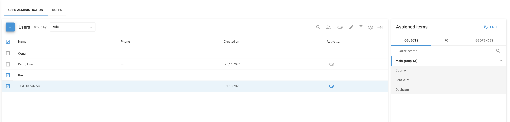
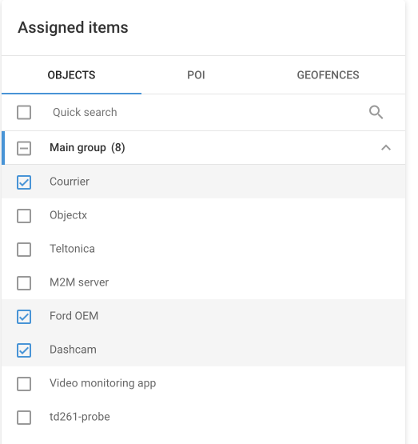
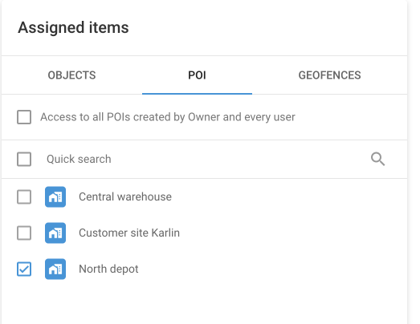
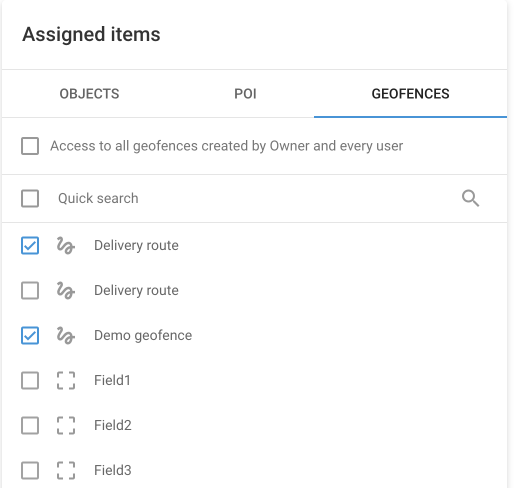
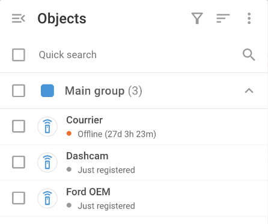

# Restricting access

Restricting access lets the account owner choose which objects, POI, and geofences each user can see. Use it when several teams or customers share one Navixy account, and each of them works with its own part of the fleet. For example:

* A regional dispatcher sees only the vehicles, depots, and delivery zones of their branch.
* A service contractor sees only the vehicles that they maintain.
* A customer of your fleet service sees only their own vehicles.

Everything else in the account stays hidden from the user, including the trips, events, and reports of other objects. Access restrictions work together with [roles](role-management.md): the role decides what a user can do, and the assigned items decide which data the user works with.


**Navigation**

Click your account name at the top of the sidebar, then click **Users and roles**. Select a user in the list and use the **Assigned items** panel. Only the account owner can open this screen.


<figure><figcaption>
Users and roles with a user selected. The Assigned items panel lists the objects that the user can see.
</figcaption></figure>

## What a user can see

The owner sees every item in the account. A user sees only the items that the owner gives them. The default access of a new user differs by item type:

| Item      | A new user sees | Items added to the account later                             |
| --------- | --------------- | ------------------------------------------------------------ |
| Objects   | No objects      | Hidden from every user until you assign them.                |
| POI       | All POI         | Visible to every user who still has access to all POI.       |
| Geofences | All geofences   | Visible to every user who still has access to all geofences. |

The assigned objects also limit the data linked to them. A user sees the trips, events, reports, rules, tasks, employees, and vehicles of their objects only. Rules, tasks, employees, and vehicles that aren't linked to any object are visible to every user.

Items that a user creates, such as a POI or a geofence, belong to the account. The owner sees them, and the user who created them keeps access to them.

## Setting up access for a user

Each user signs in with their own email and password and sees only their assigned items.

### How to add a user

To add a user, follow these steps:

1. On the **User administration** tab, click **+**.
2. Enter the **First name**, **Email**, and **Password** of the user.
3. In **Role**, select the role that the user needs.
4. Click **Save**.

Give the user the email and password that you entered. The New user form in [User administration](user-administration.md#how-to-add-a-user) shows the other fields.

### How to assign objects to a user

To assign objects to a user, follow these steps:

1. In the **Users** list, select the user.
2. In the **Assigned items** panel, click **Edit**.
3. On the **Objects** tab, select the objects that the user needs. To select all objects of a group, select the group.
4. Click **Save**, then click **Confirm**.

<figure><figcaption>
Three objects selected for the user on the Objects tab.
</figcaption></figure>


Selecting a group assigns the objects that are in the group at that moment. When you add an object to the group later, assign it to the user separately.


### How to limit POI and geofences

By default, a user sees all POI and all geofences of the account. To show the user only some of them, follow these steps:

1. In the **Users** list, select the user.
2. In the **Assigned items** panel, click **Edit**.
3. On the **POI** tab, clear **Access to all POIs created by Owner and every user**, then select the POI that the user needs.
4. On the **Geofences** tab, clear **Access to all geofences created by Owner and every user**, then select the geofences that the user needs.
5. Click **Save**, then click **Confirm**.



<figure><figcaption>
One POI selected for the user.
</figcaption></figure>



<figure><figcaption>
Two geofences selected for the user.
</figcaption></figure>




A user with the **Geofences** or **POI** right can edit and delete every geofence or POI that they see. If such a user has access to all geofences or all POI, this includes yours. Limit the access of the user, or don't give the right in their [role](role-management.md).


You can change objects, POI, and geofences in one edit and save them together.

### How to check what a user sees

You can open the account of a user without their password. To check what the user sees, follow these steps:

1. In the **Users** list, point to the user and click the **Log in as user** icon.
2. Click **Log in**.
3. Check the objects, POI, and geofences of the user, for example, on the **Tracking** map.
4. To go back to your account, click **Return to master account**.

<figure><figcaption>
The user sees only the three objects assigned to them.
</figcaption></figure>

## Changing and removing access

* To change the items of a user, select the user, click **Edit** in the **Assigned items** panel, and select or clear items. You can change the items of one user at a time.
* To stop a user from signing in for a while, turn off their **Activation** switch. Their access settings stay.
* To remove a user, delete them. Most items that they created stay in your account. See [User administration](user-administration.md#how-to-deactivate-or-delete-a-user).

## Rules and events of restricted users

A user sees the rules linked to their objects and the rules that aren't linked to any object. The user sees events only for their objects.

* A rule that also covers objects hidden from the user is read-only for that user.
* A user with the **Alert rules** right can make a rule private with **Hide from other users**. You don't see private rules, and they're deleted together with the user.

## See also

* [User administration](user-administration.md): Add, edit, deactivate, and delete users.
* [Roles](role-management.md): Learn what each right allows and how far back a user can view history.
