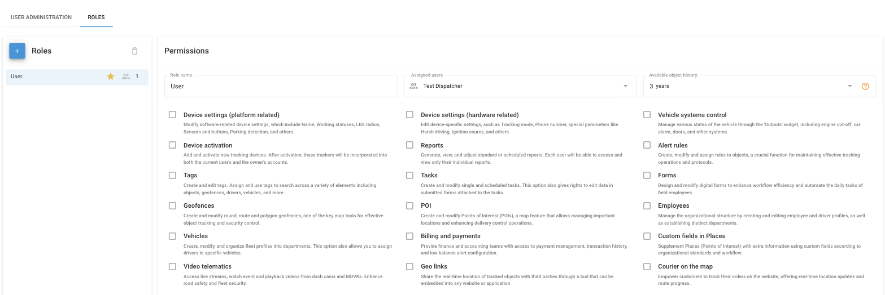

# Roles

Roles decide what the users of your Navixy account can do. Instead of setting rights for every person, you create a role once for a type of work and give it to everyone who does that work. For example:

* Dispatcher: Creates tasks and alert rules, but can't change device settings.
* Accountant: Makes payments and views the transaction history, and nothing else.
* Technician: Changes device settings and controls vehicle outputs.

A role decides what a user can do. You choose the objects, POI, and geofences of each user separately. See [Restricting access](restricting-access.md).


**Navigation**

Click your account name at the top of the sidebar, click **Users and roles**, and then click the **Roles** tab. Only the account owner can open this screen.


<figure><figcaption>
A role with its users, history period, and rights.
</figcaption></figure>

## How to create a role

To create a role, follow these steps:

1. On the **Roles** tab, click **+**.
2. Enter a **Role name** and click **Save**.
3. Select the new role in the list.
4. Under **Permissions**, select the rights that the users of the role need.
5. In **Available object history**, choose how far back the users can view trips, events, and other history of objects.
6. In **Assigned users**, select the users who get the role.
7. Click **Save**.

To change a role later, select it in the list, make your changes, and click **Save**. The changes apply to every user who has the role.

## Rights

Without any rights, a user can view the items assigned to them, but can't change anything. Each right adds one area of work:

| Right                              | What the user can do                                                                                   |
| ---------------------------------- | ------------------------------------------------------------------------------------------------------ |
| Device settings (platform related) | Change device settings that Navixy stores: name, working statuses, LBS radius, sensors and buttons, parking detection, and others. |
| Device settings (hardware related) | Change settings of the device itself: tracking mode, phone number, harsh driving, ignition source, and others. |
| Vehicle systems control            | Control vehicle systems through the **Outputs** widget, such as engine cut-off, car alarm, and doors.   |
| Device activation                  | Add and activate GPS devices. A device that the user activates is visible to that user and to the owner. |
| Reports                            | Build, view, and change reports and scheduled reports. Each user sees only their own reports.          |
| Alert rules                        | Create and change rules, and assign them to objects.                                                   |
| Tags                               | Create and edit tags.                                                                                   |
| Tasks                              | Create and change tasks and scheduled tasks, and edit the forms submitted for tasks.                   |
| Forms                              | Create and change form templates for field employees.                                                  |
| Geofences                          | Create, change, and delete geofences.                                                                  |
| POI                                | Create, change, and delete POI.                                                                        |
| Employees                          | Create and edit employees, drivers, and departments.                                                   |
| Vehicles                           | Create and edit vehicles, and assign drivers to them.                                                  |
| Billing and payments               | Make payments, view the transaction history, and set up low balance alerts.                            |
| Custom fields in Places            | Add custom fields to POI and fill them.                                                                |
| Video telematics                   | Watch live video, event videos, and recordings from dash cams and MDVRs.                               |
| Geo links                          | Share the real-time location of objects with people outside the account.                              |
| Courier on the map                 | Let customers follow their order and its courier on a website.                                         |


A right applies to every item that the user sees. For example, a user with the **Geofences** right who sees all geofences can edit and delete any geofence in the account, including yours. To prevent this, give the user selected geofences only. See [Restricting access](restricting-access.md#how-to-limit-poi-and-geofences).


Some actions are for the owner only, and no role can give them: managing users and roles, managing object groups, and working with IoT Logic.

## Available object history

**Available object history** limits how far back the users of a role can view trips, events, and other history of objects. For example, give contractors access to the last month only, and keep the full history for managers. The period can't be longer than the history included in the tariff plan of the device.

## Default role

The default role is marked with a star in the **Roles** list. Navixy selects it when you add a new user, so most users get the right role without extra steps. To make another role the default, click the gray star next to it and click **Set**.


You can't delete the default role or a role that has users. Make another role the default, or move the users to another role first.


## See also

* [User administration](user-administration.md): Add, edit, deactivate, and delete users.
* [Restricting access](restricting-access.md): Choose which objects, POI, and geofences each user can see.
