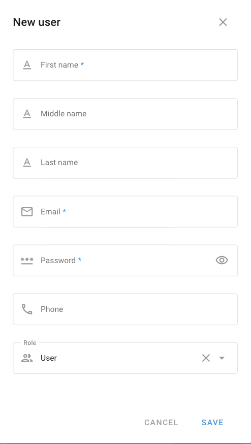

# User administration

User administration lets the account owner give each team member their own sign-in to the Navixy account. Dispatchers, managers, accountants, and contractors work in one account, each with their own tools and data. The owner keeps full control over who sees and does what.

Each user gets two kinds of limits:

* A [role](role-management.md) decides what the user can do, for example, change device settings or build reports.
* [Assigned items](restricting-access.md) decide which objects, POI, and geofences the user can see.


**Navigation**

Click your account name at the top of the sidebar, then click **Users and roles**. The **User administration** tab opens. Only the account owner can open this screen.


<figure><figcaption>
The Users list, grouped by role, and the items assigned to the selected user.
</figcaption></figure>

## Owner and users

The owner is the main account holder. The owner sees every item in the account, has every right, and is the only one who can manage users. You can't deactivate, delete, or restrict the owner.

A user signs in with their own email and password. The user sees only the items that the owner assigns and does only what their role allows.

## How to add a user

To add a user, follow these steps:

1. On the **User administration** tab, click **+**.
2. Enter the **First name**, **Email**, and **Password** of the user. The password needs at least 6 characters.
3. In **Role**, select the role that the user needs. Navixy selects the default role for you.
4. Click **Save**.

<figure><figcaption>
The New user form. First name, Email, and Password are required.
</figcaption></figure>

Give the user the email and password that you entered. Then choose what the user can see: a new user sees no objects, but all POI and geofences. See [Restricting access](restricting-access.md).

## Managing users

Point to a user in the list to see the quick actions:

* **Log in as user**: Open the account of the user without their password and check what they see. To go back, click **Return to master account**.
* **Change password**: Set a new password for the user.
* **Edit**: Change the name, email, phone, or role of the user.
* **Delete**: Delete the user.

To change the role or the status of several users at once, select them and click **Change role** or **Change status** in the toolbar.

## How to deactivate or delete a user

To stop a user from signing in, turn off their **Activation** switch. The role and assigned items of the user stay, and they work again when you turn the switch back on.


You can't restore a deleted user. Navixy deletes the reports of the user and the rules that they hid from other users. Everything else that they created stays in your account: objects that they activated, other rules, POI, geofences, employees, vehicles, and tasks.


## See also

* [Restricting access](restricting-access.md): Choose which objects, POI, and geofences each user can see.
* [Roles](role-management.md): Learn what each right allows and how far back a user can view history.
