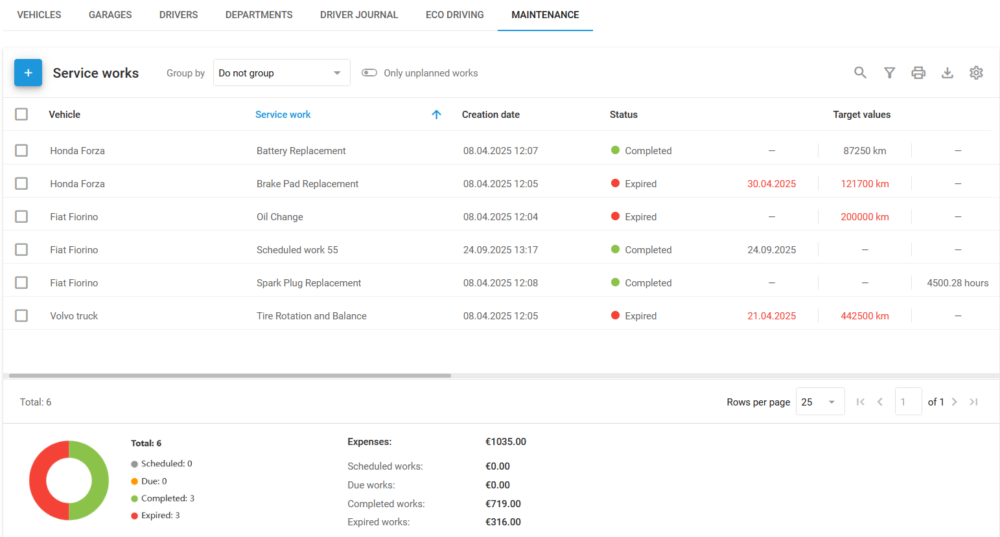
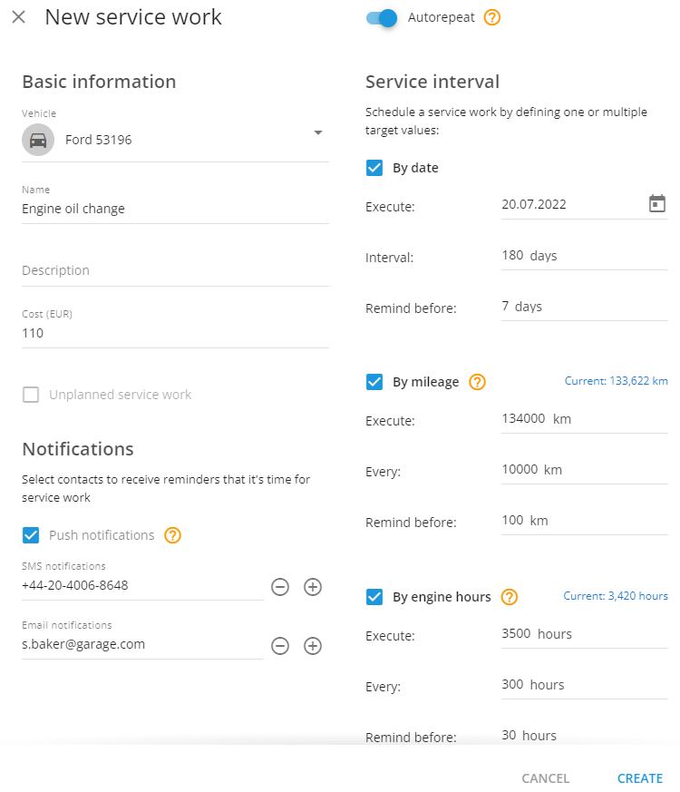
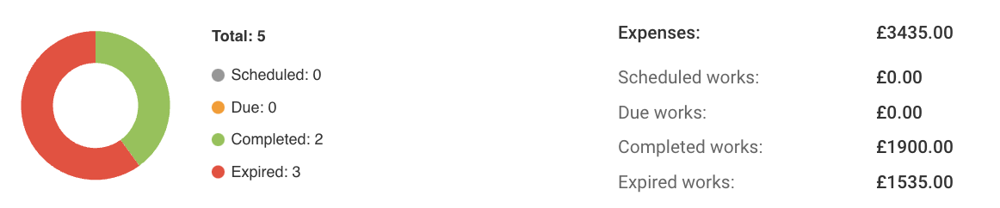

# Maintenance

**Maintenance** is the section of the **Fleet management** module where you create and track service works for your vehicles. A service work is a single maintenance task, such as an oil change or a battery replacement, tracked by date, mileage, or engine hours. This page explains how to create service works, manage and export them, automatically repeat them, and monitor their status.

Service works list

## How to add service works

Create a service work to schedule one maintenance task for one vehicle, and set how you want to be reminded about it.




### Open Maintenance

Go to the **Fleet management** application and click **Maintenance**.




### Create the service work

Click the **+** button in the top left corner, select the vehicle you want to service, and enter a **Name** for the work.




### Set the service interval

Under **Service interval**, select one or more target values:

* **By date:** Set a date for the service and get reminders before the due date.
* **By mileage:** Enter the mileage at which the service is due, and set a reminder.
* **By engine hours:** Specify engine hours for the service and get notified in advance.




### Add details

Optionally, add a **Description** and **Cost**. Set up notifications via push, SMS, or email, and attach files such as invoices if needed.




### Save the service work

Click **Create**. The Navixy platform sends notifications based on your settings.



## How to manage service works

After creating service works, you can edit, delete, copy, or export them. You can also change a task's status to **Complete** by clicking **Execute** (not displayed for already completed tasks).

### How to edit a task

Find the task in the **Maintenance** section and update the details as needed.

### How to delete a task

If a task is no longer needed, delete it from the **Maintenance** section. Deleted tasks can't be recovered.

### How to copy a task

To assign similar tasks to other vehicles, click **Copy** on the toolbar and adjust the parameters as needed.

### How to export service works

Click the download icon in the top right corner of the list to download all service works as a table in either PDF or XLSX format. The table is customizable and can contain any of the columns checked in **Column settings**:

* **Vehicle**
* **Service** work
* **Status**
* **Target values**
* **Remaining mileage**
* **Remaining hours**
* **Remaining days**
* **Cost**
* **Completed**
* **Files**
* **Description**

## How to set up repeatable service works

**Autorepeat** creates new service works automatically at the intervals you set, so you don't add them manually. Turn it on for maintenance that recurs on a fixed schedule, such as a periodic oil change.

The **New service work** dialog with **Autorepeat** enabled. Each target value you select adds its own **Execute**, **interval**, and **Remind**.

1. **Activate Autorepeat:**
   Turn on the **Autorepeat** option by toggling the switch.
2. **Select the vehicle:**
   Choose a vehicle for the service task. The Navixy platform uses data from the GPS device to monitor engine hours and mileage.
3. **Enter task details:**
   Add a **Name**. Optionally, add a **Description** and **Cost**.
4. **Set notifications:**
   Choose who receives notifications.
5. **Define the service interval:**
   1. **By date:** Schedule the first service and set intervals for future tasks.
   2. **By mileage:** Enter the target mileage and set up recurring intervals.
   3. **By engine hours:** Specify engine hours and set intervals for repeating the service.
6. **Attach files:**
   Attach any relevant documents if needed.

The Navixy platform automatically creates new tasks based on the intervals you set.

## How to monitor service tasks

Every service work has one of four statuses:

* **Scheduled:** Tasks that are planned but not yet due.
* **Due:** Tasks that have entered the reminder window set by **Remind before**.
* **Completed:** Tasks that have been finished.
* **Expired:** Tasks that weren't completed on time.

The summary panel under the list shows how many service works fall into each status, along with the total cost of each group.
