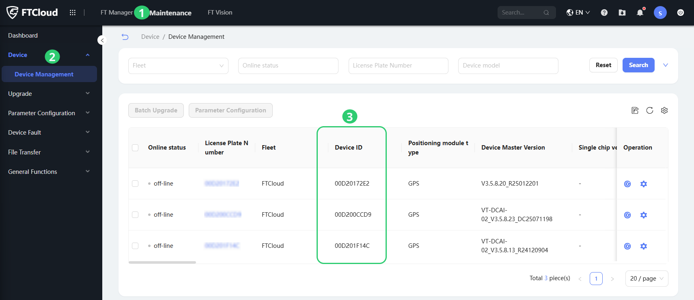
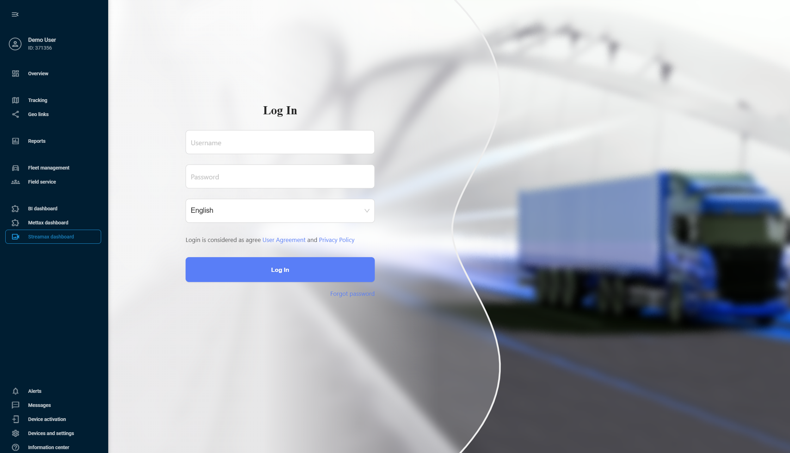

# Streamax

Streamax is a leading MDVR manufacturer, well-proven in the global market. With their devices, you can enable 24/7 video recording from your vehicles, collect telematics data, remotely access video footage, and monitor driving safety using ADAS (Advanced Driver Assistance Systems) and DSM (Driver Status Monitoring) technologies.

By integrating Streamax with Navixy, you get comprehensive video monitoring combined with advanced fleet management in a single interface. Let's take a closer look at how to implement this powerful combination and embed Streamax dashboard into Navixy interface.



**Establishing integration**

To establish the integration, you'll need to obtain API credentials from your Streamax account and request integration setup from our support team.

**Get API credentials from Streamax**

1. **Copy the Secret Key**: Streamax stores API secrets as named keys. The integration uses the **Default Secret**, the key that has full access to your data and to all APIs. A key you create yourself can be limited to certain fleets or certain APIs, and the integration does not work with a limited key.
   1. In FTCloud, open **FT Manager**.
   2. In the sidebar, select **General Setting**, then **Whitelist Key**.
   3. Open the **Default Secret** entry.
   4. Copy its **Secret Key**, a 32-character value. The [Streamax Sign Authentication documentation](https://ftcloud.streamax.com:20002/DOC/Sign%20Authentication) calls this value `tenantSecret`.
2. **Find the Tenant ID**:
   1. Open your Streamax account in a browser and press F12. The developer tools open.
   2. Select the **Network** tab.
   3. Go to the **My subscription** page.
   4. In the **Network** tab, find a request that has `tenantId=` in its address. Your tenant ID is the number after the equals sign. Copy it.
3. **Contact Navixy**: Once you have your API credentials, contact your Customer Success Manager or use [this form](https://www.navixy.com/contact/). Ask to integrate Streamax with your Navixy account, and include:
   1. Streamax connection details for your account
      1. **Full Streamax account URL**\
         (e.g. `https://{your_streamax_instance}.ifleetvision.com`)
      2. **Tenant Name**
      3. **Tenant ID**
      4. **Secret Key**
   2. Your Navixy account details
4. **Wait for confirmation**: Our specialists will configure the integration in 1-3 days on our side and confirm when it's ready for use.


After you receive the confirmation from our support, your Streamax account is ready for the integration!




**Adding a Streamax device to Navixy**

After receiving confirmation from our support team that the integration is ready, you can add your Streamax device to the platform. To do it, first find its **Device ID** in your Streamax dashboard:

1. Go to Maintenance tab in your Streamax account
2. Expand the **Device** section and select **Device Management**
3. Copy the needed **Device ID** value

<figure><figcaption></figcaption></figure>

To activate the device on Navixy's side, follow the usual activation procedure:

1. Go to **Device activation**.
2. Select your Streamax device from the list.
3. Enter a correct **Device ID**
4. Complete the device configuration

For detailed instructions on how to activate a device in Navixy, see [Activate GPS device](../quick-start/activate-gps-device.md).


Your device and Navixy account are ready for the integration!




**Embedding Streamax in Navixy UI**

At this step, we perform the actual integration by embedding the Streamax dashboard into your Navixy interface.\
Navixy offers [User applications](../account/user-applications/) functionality that allows embedding 3rd-party apps directly in the platform’s interface. We will use it to embed Streamax.


**Navigation**

**User applications** section is accessible to account **Owners** in the **Account Settings** section. To find it:

* Click the profile icon in the top-left corner of the screen to open your account settings
* In the settings sidebar, select **User applications**


1. Create new application\
   Start by clicking the  button in the **User applications** list.
2. Configure the new application
   1. Put the link to your Streamax account in the **App URL** field, for example: `https://{your_instance}.ifleetvision.com/ftv/ft/dashboard#`.
   2. Enter a **Label** for the application (e.g., Streamax dashboard).
   3. Select **Embedded** in the **Show as** field to display Streamax functionality within Navixy.
3. Click **Save** to complete the configuration.


Your new application appears automatically in Navixy's left sidebar. Open it and log in with your Streamax credentials to access your comprehensive video telematics dashboard with 360° monitoring, AI-powered event detection, and multi-channel video feeds - all integrated with your existing Navixy fleet management tools.




