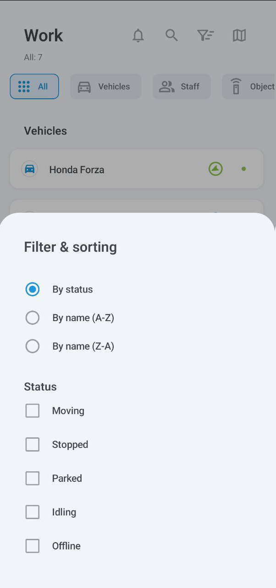

# Tracking in X-GPS Mobile


{% column width="50%" %}
The **Tracking** section contains all your assets: vehicles, staff, and objects (unassigned GPS devices). To view [more information about any of your assets](asset-information.md), tap its entry. To find a specific asset, tap  and enter its name.

The icon to the right of each asset indicates its movement status, such as moving or parked.


{% column width="50%" %}
<figure><figcaption>
Asset list
</figcaption></figure>



### Events



Tap  to view the events.

This screen shows various events occurring to your assets, such as leaving or entering a geofence, going idle, speeding, completing tasks, and more. To filter by category type, tap **All**, **Vehicles**, **Staff**, or **Objects**  (GPS devices not assigned to vehicles or staff).

The second menu shows your current filters, all of which can be configured: time period, specific vehicles or staff, and event types. The **Unread** filter displays only the unread notifications, while **Emergency** narrows down your search to urgent events.



<figure><figcaption>
Events
</figcaption></figure>



### Map



Tap  to open an interactive map displaying your assets.

You can zoom in and out and center the map on your own GPS coordinates. Tap the vehicle’s icon to follow its route and view its current status and location. Tap  again to open the vehicle’s details.



<figure><figcaption>
Fullscreen map
</figcaption></figure>



Tap  to open the map options menu:

<table data-header-hidden><thead><tr><th valign="top"></th><th valign="top"></th><th valign="top"></th></tr></thead><tbody><tr><td valign="top"></td><td valign="top"></td><td valign="top"></td></tr></tbody></table>

The map options menu allows you to select Places (such as client locations for delivery), geofences, and map type.

### Sorting and filtering



The list has two filtering methods: by category and by status.

To filter by category, tap **All**, **Vehicles**, **Staff**, or **Objects**.

To filter by status (moving, stopped, parked, idling, and offline), tap  to open the **Filter & sorting** menu. In addition to filtering, this menu also allows sorting assets by name.



<figure><figcaption>
Filter &#x26; sorting
</figcaption></figure>


